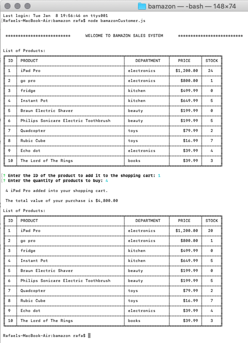

# bamazon

Bazamon is a basic node.js CLI application for a store. It displays to the user a list of available products, captures the selected product and the desired quantity, check stock availability and finalizes the sell

## How it works

To run the application enter '''node bamazonCustomer.js'''

The app will connect with the MySQL database and retrieve the list of available items on the product table to display in a table. 

Then, the app inquires the user to enter the product ID and the desired quantity. There is a validation login on the product ID, but not in quantity.

If the user enters a quantity higher than the available stock, the order is cancelled. Otherwise, the system updates the database by subtracting the number requested and finalize the process by returning the total cost of the products.

## Screenshots

